## Abstract
<!-- - Summarize the project: motivation, methods, findings, etc.  -->

This project develops and evaluates trading algorithms for VN30F1M futures, a derivative tied to Vietnam’s VN30 index, aiming to achieve consistent profitability in dynamic market conditions. Two strategies are implemented: an original algorithm using fixed parameters for the Moving Average Convergence Divergence (MACD), Relative Strength Index (RSI), and Average True Range (ATR) indicators, and a dynamic variant that adjusts ATR-based risk levels based on short-term versus long-term volatility. Historical data from 2020 to 2024 is utilized, with in-sample testing (2020–2023) for strategy development and out-of-sample testing (2024) for validation. Through grid search optimization, key parameters are tuned to maximize returns while controlling risk. Results indicate that both strategies generate positive returns, with the dynamic algorithm outperforming the original by adapting to volatility shifts, achieving higher Holding Period Returns (HPR) and lower Maximum Drawdowns (MDD). The findings suggest that volatility-adaptive strategies enhance trading performance, though success remains sensitive to market trends, highlighting the need for ongoing refinement.

## Introduction
<!-- - Briefly introduce the project.
- Problem statement, research question or the hypothesis.
- Method(s) to solve the problem
- What are the results? -->

The VN30F1M futures contract, representing leveraged exposure to Vietnam’s VN30 index, offers significant opportunities for systematic trading due to its liquidity and volatility. This project aims to design and backtest trading algorithms that exploit price movements in VN30F1M futures while managing risk effectively. The central research question is: *Can a combination of MACD, RSI, and ATR indicators form a robust trading strategy that outperforms a buy-and-hold approach across diverse market conditions?*

To address this, two algorithmic strategies are developed. The original strategy employs fixed parameters to generate trading signals based on MACD for trend detection, RSI for momentum confirmation, and ATR for setting stop-loss and take-profit levels. The dynamic strategy enhances this by adjusting ATR multipliers according to volatility trends, aiming to improve adaptability.

Preliminary results show that both strategies yield positive returns, with the dynamic variant demonstrating superior performance due to its responsiveness to market volatility. Optimized parameters enhance profitability, though performance varies with market conditions, suggesting potential for further improvements through adaptive techniques.


## Related Work
<!-- - Prerequisite reading if the audience needs knowledge before exploring the project.
- Optional -->

The development of systematic trading strategies for financial instruments like futures has long been a cornerstone of quantitative finance. This project leverages established principles from technical analysis, futures trading, and algorithmic backtesting, applying them to the VN30F1M futures contract—a monthly derivative tied to Vietnam’s VN30 index. Here, we outline the foundational concepts and prior work that inform our approach, setting the stage for the project’s contributions.

Technical analysis uses historical price and volume data to predict market movements, relying heavily on indicators such as:

- **Moving Average Convergence Divergence (MACD)**: Developed by Gerald Appel in the 1970s, MACD is a trend-following momentum indicator. It calculates the difference between a 12-day and 26-day exponential moving average (EMA), with a 9-day EMA signal line triggering buy or sell signals via crossovers. MACD excels at identifying trend shifts but can lag in volatile conditions.
- **Relative Strength Index (RSI)**: Introduced by J. Welles Wilder in 1978, RSI measures momentum on a 0–100 scale, flagging overbought (above 70) or oversold (below 30) conditions. While effective in range-bound markets, RSI may generate false signals during strong trends.
- **Average True Range (ATR)**: Also by Wilder, ATR measures volatility by averaging the true range over a period (typically 14 days). It’s widely used to set dynamic stop-loss and take-profit levels, adapting to market conditions.
These indicators are often applied individually or in basic pairs. This project, however, integrates MACD for trend detection, RSI for momentum confirmation, and ATR for risk management, creating a more comprehensive framework for trading signals and position sizing.

### Futures Trading and VN30F1M

Futures contracts are agreements to trade an asset at a set price on a future date. The VN30F1M, tied to the VN30 index of the top 30 stocks on the Ho Chi Minh Stock Exchange, is a popular instrument in Vietnam due to its leverage and hedging potential (Ho Chi Minh Stock Exchange, 2023).

While extensive research exists on global futures like the S&P 500, studies on VN30F1M are scarce. Emerging market research suggests volatility-based strategies may thrive in such contexts. This project fills a gap by tailoring technical indicators to VN30F1M, with a focus on volatility adaptation.

### Backtesting Methodologies

Backtesting evaluates trading strategies using historical data, emphasizing:
- **Data Quality**: Clean, bias-free data is critical.
- **Transaction Costs**: Slippage and commissions must be factored.
- **Risk Metrics**: Metrics like Maximum Drawdown and Sharpe Ratio assess performance.

This project follows these principles, using cleaned VN30F1M data, incorporating costs (e.g., taxes), and applying in-sample/out-of-sample testing to ensure robustness and avoid overfitting.

### Algorithmic Trading Strategies

Algorithmic trading spans simple moving average systems to complex learning. Indicator-based strategies remain prevalent for their transparency and practicality. Recent work shows:
- Combining MACD and RSI reduces false signals.
- ATR-based stop-losses enhance risk control in trend strategies.

This project builds on these insights, applying a multi-indicator approach to VN30F1M with a novel twist: a dynamic ATR that adjusts risk based on short- and long-term volatility. This aims to improve performance in Vietnam’s dynamic market.


## Trading Hypotheses
- Our initial asset is set at 200,000,000 VND.
- We aim to smooth out the equity curve and reduce drawdowns with our algorithm.
- Considering the two strategies below:
    - Price Momentum: Thrives during trending markets, when price keeps moving in the same direction.
    - Mean Reversion: Thrives during range-bound markets, when price tends to bounce back to a fair value or average.
- Because markets constantly switch between trending and ranging states, an algorithm combining both strategies may satisfy our objectives.
- For this hybrid approach, we divide the asset into two halves during each trading day, assigning each half as an independent asset for each strategy we mentioned above.
- We apply MACD and RSI as our trend indicator and momentum indicator, respectively.
- A volatility indicator, ATR, is also employed for risk management. For exploring purpose, we design two seperate algorithms:
    - One with a set ATR-multiplier.
    - One with a dynamic ATR-multiplier based on a long and a short ATR window.
- Each strategy has their own set of MACD, RSI and ATR parameters, with the condition specified below:

| Strategy | Position Type | Entry Conditions | Exit Conditions |
|-|-|-|-|
| Price Momentum | LONG | MACD > 0<br>50 < RSI < (100 - x) | cur_price >= take_profit<br>cur_price <= stop_loss<br>RSI >= (100 - x)<br>MACD < 0 |
| Price Momentum | SHORT | MACD < 0<br>x < RSI < 50 | cur_price <= take_profit<br>cur_price >= stop_loss<br>RSI <= x<br>MACD > 0 |
| Mean-Reversion | LONG | MACD > 0<br>RSI_rev < x | cur_price >= take_profit<br>cur_price <= stop_loss<br>MACD < 0<br>RSI >= 50 |
| Mean-Reversion | SHORT | MACD < 0<br>RSI > x |cur_price <= take_profit<br>cur_price >= stop_loss<br>MACD > 0<br>RSI <= 50 |

- ***Note*** :
    - Each entry conditions needs to be satisfied at the same time to open a position, while any exit conditions satisfied will signal the close of a position.
    - The 'x' value can be varied in the range [20, 30] in Price Momentum strategy, while it is set to 30 in Mean-Reversion strategy
    - The stop_loss and take_profit thresholds are calculated as follow for both strategies:

| Position Type | Stop Loss Formula | Take Profit Formula |
|-|-|-|
| LONG | stop_loss = entry_price - ATR * multiplier | take_profit = entry_price + ATR * multiplier |
| SHORT | stop_loss = entry_price + ATR * multiplier | take_profit = entry_price - ATR * multiplier |

- We open at most 3 SHORT positions for each strategy, depending on the current asset value assigned to it.
- For LONG positions, when conditions are met, each strategy will use up their shared amount.

## Data
- **Data Source**: Historical VN30F1M index data fetched via the `vnstock`, provided by TCBS (Techcom Securities).
- **Data Type**: Daily OHLC (Open, High, Low, Close) prices.
- **Data Period**: January 1, 2020, to January 1, 2025.
  - **In-sample**: 2020-01-01 to 2024-01-01 (for strategy development and optimization).
  - **Out-of-sample**: 2024-01-01 to 2025-01-01 (for validation on unseen data).
- **Input Data**: Data is fetched programmatically via the `Vnstock().stock(symbol="VN30F1M", source="TCBS").quote.history()` function for VN30F1M futures.
- **Output Data**: Processed data stored in pandas DataFrames for analysis and backtesting.
    - **In-memory**: Stored as pandas DataFrames during script execution for efficient computation and analysis.
    - **Persistent Storage**: Saved to Excel files (`in_sample_VN30F1M.xlsx`, `out_sample_VN30F1M.xlsx`) for future use and reference.
### Data collection
- **Process**: The `load_data` function fetches raw OHLC data for VN30F1M via the `vnstock`.
```python
def load_data(symbol, start_date='2020-01-01', end_date='2025-01-01'):
    """
    Load data from vnstock.

    Parameters:
    - symbol (str): Ticker symbol ('VN30F1M' for futures).
    - start_date (str): Start date for data retrieval (format: 'YYYY-MM-DD').
    - end_date (str): End date for data retrieval (format: 'YYYY-MM-DD').

    Returns:
    - data (pd.DataFrame): data with OHLC columns.
    """
    # Initialize vnstock client
    stock = Vnstock().stock(symbol=symbol, source='TCBS')

    # Fetch historical OHLC data
    try:
        data = stock.quote.history(start=start_date, end=end_date)
    except Exception as e:
        raise ValueError(f"Failed to fetch data for {symbol}: {str(e)}")

    return data
```
### Data Processing
- **Steps**:
    - Standardize column names.
    - Convert 'Time' column to datetime and set as index.
    - Remove duplicates and handle missing values.
    - Split into in-sample and out-of-sample.
    - Validate data integrity (no missing OHLC values).
- **Output**:
    - In-sample data and Out-sample data with OHLC columns.

```python
def process_split_data(data: pd.DataFrame, split_date='2024-01-01'):
    """
    Process and split data for backtesting.

    Parameters:
    - data (pd.DataFrame): Raw data with OHLC columns.
    - split_date (str): Date to split in-sample and out-of-sample data (format: 'YYYY-MM-DD').

    Returns:
    - tuple: (in_sample_df, out_sample_df)
        - in_sample_df (pd.DataFrame): Preprocessed in-sample data with OHLC columns.
        - out_sample_df (pd.DataFrame): Preprocessed out-sample data with OHLC columns.
    """
    # Standardize column names (capitalize first letter)
    data = data.rename(columns=lambda x: x.capitalize())

    # Convert 'Time' column to datetime and set as index
    data['Time'] = pd.to_datetime(data['Time'])
    data = data.sort_values('Time').set_index('Time')

    # Remove duplicates and handle missing values
    data = data.drop_duplicates()
    data = data.dropna(subset=['Open', 'High', 'Low', 'Close'])

    # Split into in-sample and out-of-sample
    split_timestamp = pd.Timestamp(split_date)
    in_sample = data[data.index < split_timestamp]
    out_sample = data[data.index >= split_timestamp]

    # Validate data integrity (no missing OHLC values)
    required_columns = ['Open', 'High', 'Low', 'Close']
    for df in [in_sample, out_sample]:
        if not all(col in df.columns for col in required_columns):
            raise ValueError(f"Missing required columns in data: {required_columns}")

    return in_sample, out_sample
```


| In-sample Data Graph | Out-sample Data Graph |
|:---------------------------------------:|:---------------------------------------:|
| 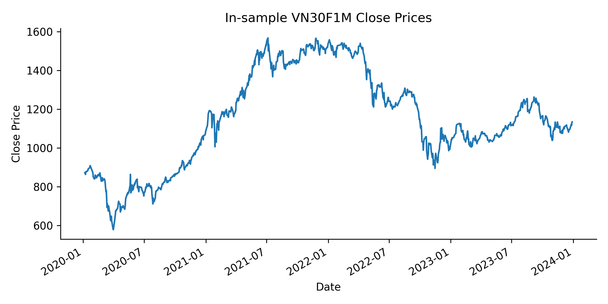{ width=400 } | { width=400 } |


## Implementation

### Overview

This module implements two trading strategies:

- `algo`: A **basic hybrid strategy** combining Momentum and Mean Reversion with fixed rules.
- `dynamic_algo`: An **improved version** of `algo` with **adaptive ATR-based risk management**.

---

### 1. `algo`: Static Hybrid Strategy

#### Objective
Split capital into two sub-portfolios:
- One follows a **Momentum strategy**.
- One follows a **Mean Reversion strategy**.

Each strategy uses **MACD**, **RSI**, and **ATR** to trigger trades and manage risk.

---

#### Step-by-Step Breakdown

##### **Step 1: Initialization**
```python
cash = ASSET_VALUE
holdings_momentum = []
holdings_reversion = []
```
- `cash`: tracks the available cash.
- `holdings_momentum`: stores all active momentum trades.
- `holdings_reversion`: stores all active mean reversion trades.

---

##### **Step 2: Calculate Technical Indicators**

###### For Momentum Strategy:
```python
data['MACD_diff_mom'] = ta.trend.macd_diff(...)
data['RSI_mom'] = ta.momentum.rsi(...)
data['ATR_mom'] = ta.volatility.average_true_range(...)
```
- **MACD_diff**: positive → upward momentum, negative → downward.
- **RSI**: momentum strength. Overbought (>70) or oversold (<30) signals.
- **ATR**: volatility estimate, used to set stop-loss/take-profit ranges.

###### For Reversion Strategy:
```python
data['MACD_diff_rev'] = ta.trend.macd_diff(...)
data['RSI_rev'] = ta.momentum.rsi(...)
data['ATR_rev'] = ta.volatility.average_true_range(...)
```
- Same indicators, but used with **opposite logic**: trade **against** short-term trends.

---

##### **Step 3: Loop Through Time**
```python
for i in range(1, len(data)):
    row = data.iloc[i]
    ...
```
We iterate over each row (i.e., each time step) to check conditions and manage trades.

---

##### **Step 4: Manage Open Positions**

###### Closing Rules:
- Sell (or cover short) when:
  - Take-profit is reached.
  - Stop-loss is triggered.
  - Indicators show weakening trend.

```python
if pos_type == 'LONG':
    if cur_price >= take_profit or cur_price <= stop_loss or RSI too high:
        cash += quantity * cur_price - quantity * TAX
        holdings_momentum.remove(position)
```

Each position is reviewed. If conditions are met, we close the trade and update `cash`.

---

##### **Step 5: Compute Portfolio Value**
```python
total_unrealized = ...
trading_data.loc[date, 'Asset'] = cash + total_unrealized
```
- We compute the **current net asset value (NAV)** of the portfolio.
- This includes `cash` and the **unrealized PnL** from open positions.

---

##### **Step 6: Open New Positions If None Are Open**

###### Momentum Entry:
```python
if row['MACD_diff_mom'] > 0 and RSI is in buy zone:
    holdings_momentum.append((..., 'LONG', ...))
elif row['MACD_diff_mom'] < 0 and RSI is in sell zone:
    holdings_momentum.append((..., 'SHORT', ...))
```
- Buy when momentum is strong and RSI confirms.
- Sell short when negative momentum is confirmed.

###### Reversion Entry:
```python
if row['MACD_diff_rev'] > 0 and RSI < 30:
    holdings_reversion.append((..., 'LONG', ...))
elif row['MACD_diff_rev'] < 0 and RSI > 70:
    holdings_reversion.append((..., 'SHORT', ...))
```
- Buy when RSI is oversold.
- Sell short when RSI is overbought.
- Entry size is fixed: 50% of total capital.

---

##### **Step 7: Compute Daily Returns**
```python
trading_data['Return'] = trading_data['Asset'].pct_change()
```
- Used for backtesting, plotting, and performance metrics.

---

### 2. `dynamic_algo`: Adaptive Hybrid Strategy

#### Objective
Enhance the original strategy by making **ATR multipliers dynamic**, adapting to **recent volatility changes**.

---

#### Key Innovation

| Feature | `algo` | `dynamic_algo` |
|--|-|-|
| ATR Multiplier | Fixed (e.g., ×2) | Dynamic based on short vs long ATR |
| Volatility Awareness | No | Yes |
| Risk/Reward Adaptability | Static | Adjusts with market conditions |

---

#### Step-by-Step Breakdown (Differences Only)

##### **Step 2 (Updated): Compute Two ATRs for Each Strategy**
```python
data['ATR_mom_short'] = ta.volatility.average_true_range(..., window=10)
data['ATR_mom_long'] = ta.volatility.average_true_range(..., window=20)

data['ATR_rev_short'] = ta.volatility.average_true_range(..., window=7)
data['ATR_rev_long'] = ta.volatility.average_true_range(..., window=14)
```
- **Short-term ATR**: reflects recent volatility.
- **Long-term ATR**: smooths noise.
- We compare them to **adjust stop-loss / take-profit** ranges.

---

##### **Step 3.1: Calculate Dynamic Multipliers**
```python
if row['ATR_mom_short'] > row['ATR_mom_long']:
    momentum_atr_multiplier = 3.0
else:
    momentum_atr_multiplier = 2.0
```
- If short-term volatility > long-term → market is volatile → use **wider** stop-loss.
- This allows **room for price to breathe** during high volatility.

Same logic is applied for the reversion strategy.

---

##### **Step 4–7: Same as `algo`**, except that **stop-loss / take-profit** levels are now calculated using **dynamic multipliers**:

```python
stop_loss = entry_price - ATR * momentum_atr_multiplier
take_profit = entry_price + ATR * momentum_atr_multiplier
```

---

### Output

Both functions return a DataFrame with:
```python
['Asset', 'Return']
```
- `Asset`: net portfolio value each day.
- `Return`: daily percentage return.

---

### When to use

- Use `algo` when the market is **stable and predictable**.
- Use `dynamic_algo` when market volatility **changes frequently** and you need **better risk management**.

---

## In-sample Backtesting
### Parameters
```python
# Non-dynamic Parameters
MOMENTUM_FAST_EMA = 10
MOMENTUM_SLOW_EMA = 15
MOMENTUM_SIGNAL_EMA = 5
MOMENTUM_RSI_WINDOW = 10
MOMENTUM_RSI_THRESHOLD = 30
MOMENTUM_ATR_WINDOW = 7
MOMENTUM_ATR_MULTIPLIER = 2.0

REVERSION_FAST_EMA = 20
REVERSION_SLOW_EMA = 20
REVERSION_SIGNAL_EMA = 5
REVERSION_RSI_WINDOW = 10
REVERSION_ATR_WINDOW = 7
REVERSION_ATR_MULTIPLIER = 1.5

# Dynamic Parameters
MOMENTUM_FAST_EMA = 10
MOMENTUM_SLOW_EMA = 15
MOMENTUM_SIGNAL_EMA = 5
MOMENTUM_RSI_WINDOW = 10
MOMENTUM_RSI_THRESHOLD = 30
MOMENTUM_ATR_WINDOW = 7

REVERSION_FAST_EMA = 20
REVERSION_SLOW_EMA = 20
REVERSION_SIGNAL_EMA = 5
REVERSION_RSI_WINDOW = 10
REVERSION_ATR_WINDOW = 7
```
### Data
| Time       | Open   | High   | Low    | Close  | Volume |
|------------|--------|--------|--------|--------|--------|
| 2020-01-06 | 877.5  | 883.5  | 871.6  | 872.0  |  83770 |
| 2020-01-07 | 873.9  | 877.8  | 871.6  | 875.0  |  83997 |
| 2020-01-08 | 868.0  | 871.0  | 863.4  | 863.7  |  90489 |
| 2020-01-09 | 869.1  | 876.2  | 868.7  | 874.8  |  75461 |
| 2020-01-10 | 876.1  | 884.4  | 875.4  | 878.7  |  82465 |
| ...        | ...    | ...    | ...    | ...    |   ...  |
| 2023-12-25 | 1096.3 | 1119.2 | 1096.3 | 1115.0 | 151250 |
| 2023-12-26 | 1115.4 | 1121.5 | 1113.4 | 1121.5 | 132261 |
| 2023-12-27 | 1121.8 | 1126.2 | 1116.9 | 1116.9 | 135934 |
| 2023-12-28 | 1118.3 | 1135.2 | 1117.0 | 1132.9 | 157595 |
| 2023-12-29 | 1133.2 | 1139.5 | 1130.9 | 1134.6 | 160159 |

### Step 4 of the Nine-Step

### In-sample Backtesting Result
- Non-dynamic algorithm result:
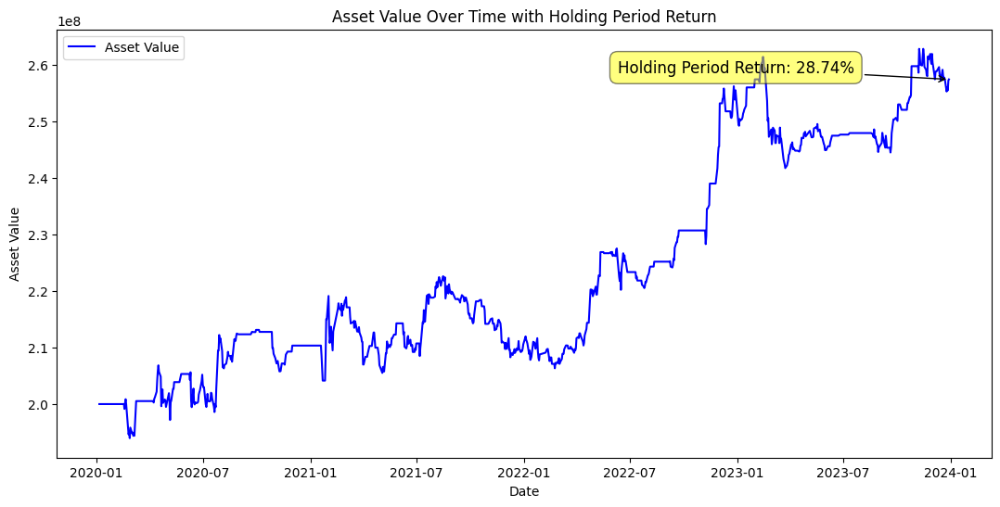
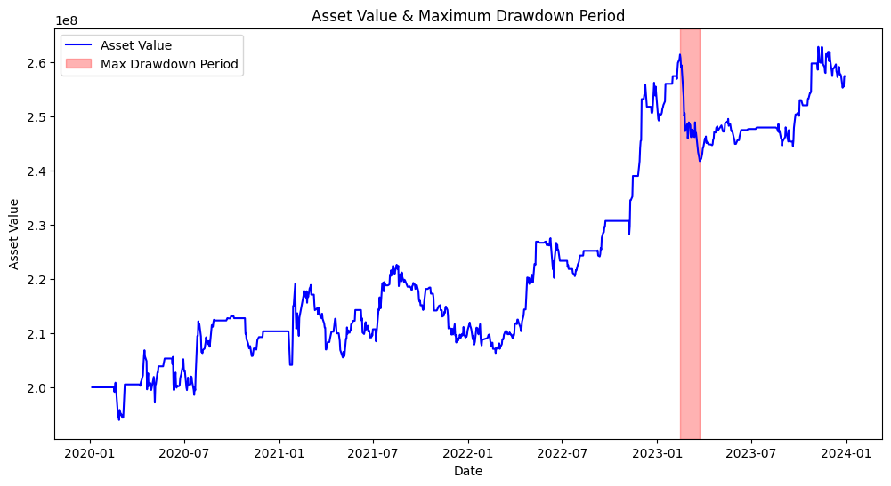


- Dynamic algorithm result
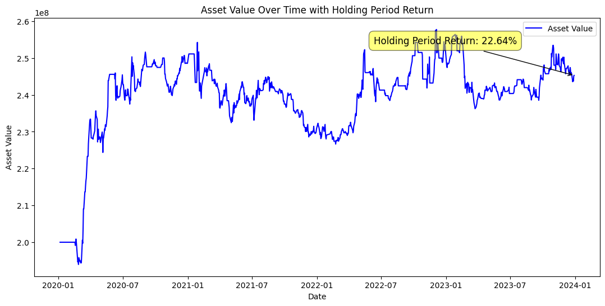
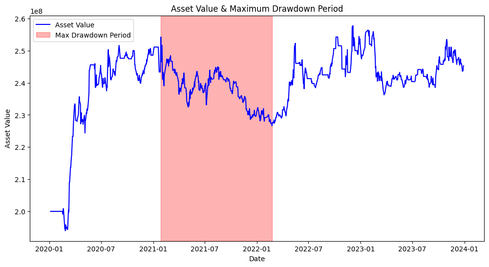
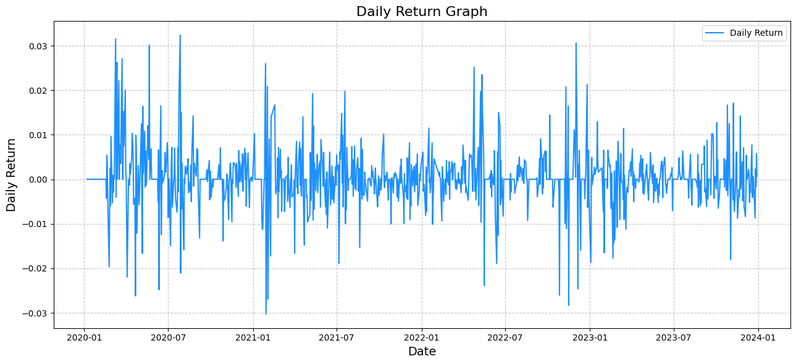


## Optimization
- We implement optimization by manually doing a grid search loop through every possible set of values for each parameters.
- Each strategy has their own set of parameters, as stated below:
    - MACD: `Fast EMA Window`, `Slow EMA Window`, `EMA Signal Window`
    - RSI: `RSI Window`
    - ATR: `ATR Window`
- For Price Momentum strategy, it has an additional parameter of `RSI Threshold` to decide the exit condition.
- Each strategy from the non-dynamic-ATR algorithm also has an additional parameter of `ATR Multiplier` to set the take profit/cut loss thresholds.
- The details for the range of each parameter, correspondng to each strategy is specified in the table below:

| Parameter | Price Momentum Range | Mean-Reversion Range |
|-|-|-|
| **Fast EMA Window** | 7 to 14 | 10 to 19 |
| **Slow EMA Window** | 20 to 29 | 25 to 39 |
| **EMA Signal Window** | 7 to 9 | 9 to 14 |
| **RSI Window** | 2 to 7 | 10 to 14 |
| **RSI Threshold** | 20, 25, 30 | *Not used* |
| **ATR Window** | 8 to 19 | 6 to 14 |
| **ATR Multiplier** | 2.0, 2.5, 3.0 | 1.0, 1.5, 2.0 |

- Since each algorithm has more than 10 parameters and most of them has the range of about 5 to 10 values, doing grid search for both strategy at the same time is not possible. Hence, we decide to optimize each strategy independently, then combine the best parameters of each strategy into a single set of best parameters for each algorithm.
- During optimization, our loss function is defined as follow:
$\displaystyle y = hpr + \frac{mdd}{10} - \frac{ldd}{100} + \left(\frac{sharpe + sortino}{2}\right) ^ 3$

    where:
    - $hpr$: The Holding Period Return of the portfolio
    - $mdd$: The Maximum Drawdown of the portfolio
    - $ldd$: The Longest Drawdown of the portfolio
    - $sharpe$: The Sharpe Ratio of the portfolio
    - $sortino$: The Sortino Ratio of the portfolio

### Optimization Result
- Non-dynamic algorithm result
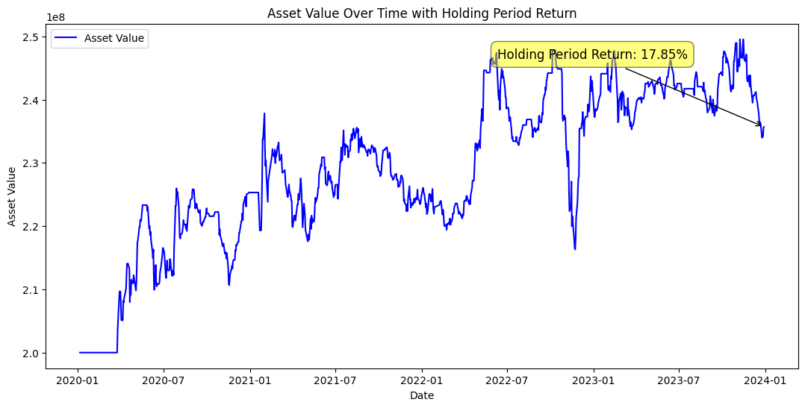
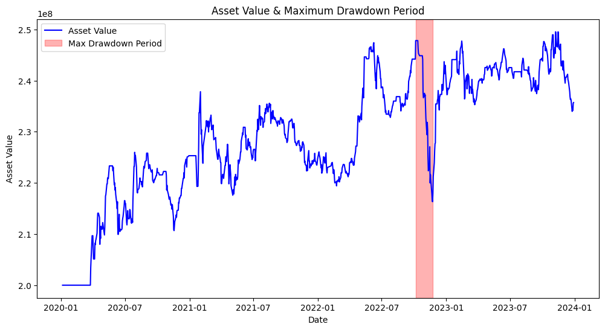


- Dynamic algorithm result
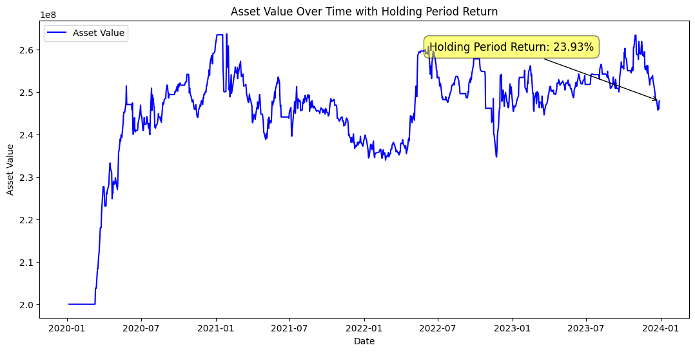
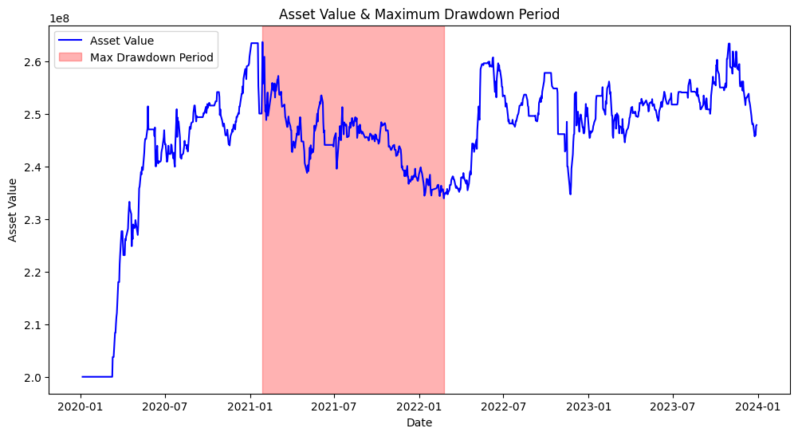
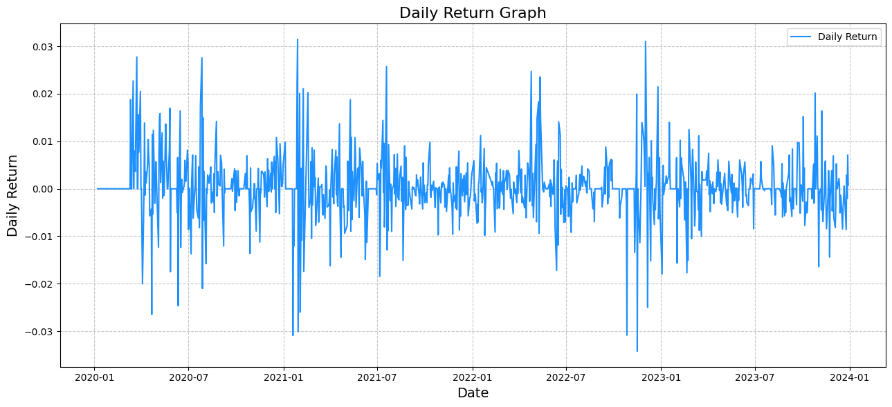

## Optimization with Optuna
- For this part, our objective is simply the final net asset value.
- The details for the range of each parameter, correspondng to each strategy is specified in the table below:

| Parameter | Price Momentum Range | Mean-Reversion Range |
|-|-|-|
| **Fast EMA Window** | 1 to 25 | 1 to 25 |
| **Slow EMA Window** | 1 to 40 | 1 to 40 |
| **EMA Signal Window** | 1 to 20 | 1 to 20 |
| **RSI Window** | 1 to 50 | 1 to 50 |
| **RSI Threshold** | 1 to 30 | *Not used* |
| **ATR Window** | 1 to 20 | 1 to 20 |
| **ATR Multiplier** | 0.5 to 10.0 | 0.5 to 10.0 |

### Optimization with Optuna Result
- Non-dynamic algorithm result
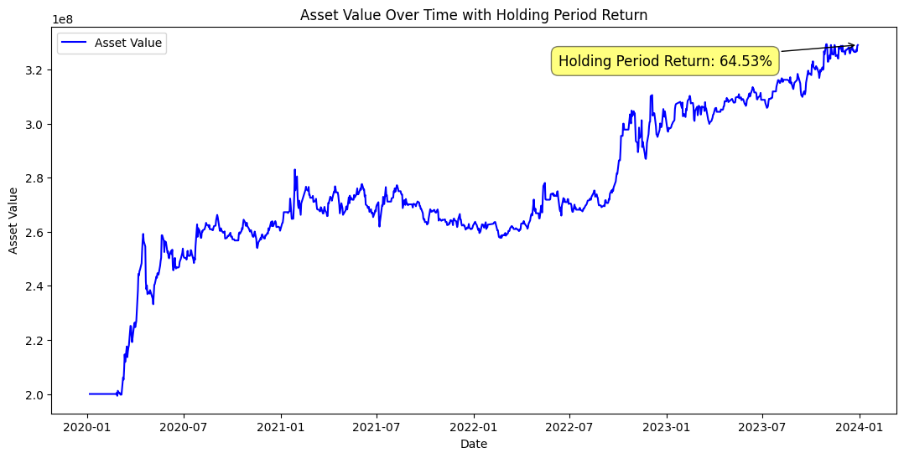
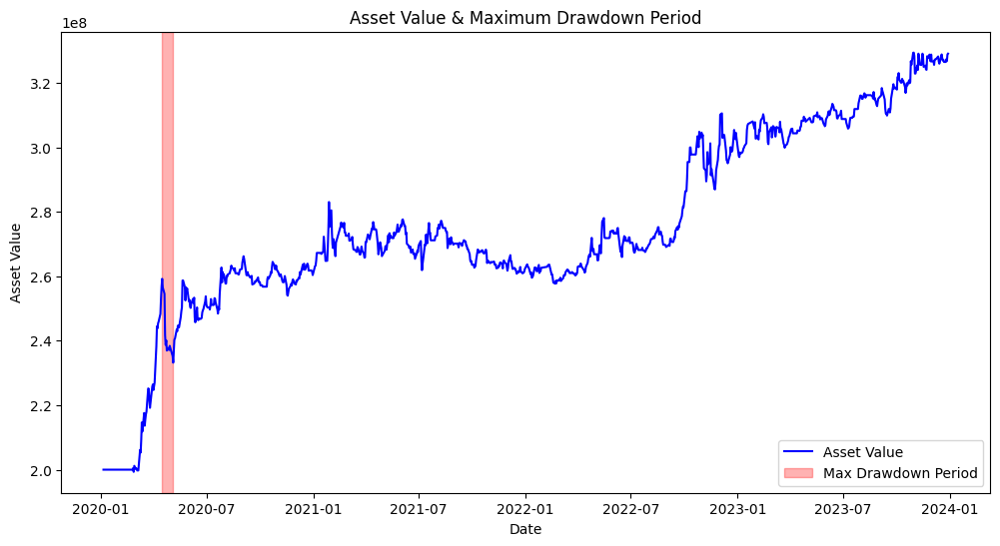
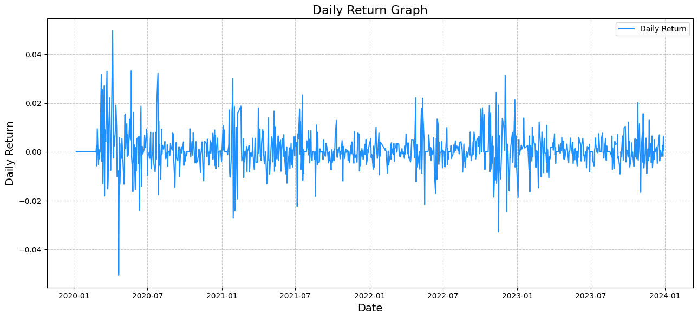

- Dynamic algorithm result

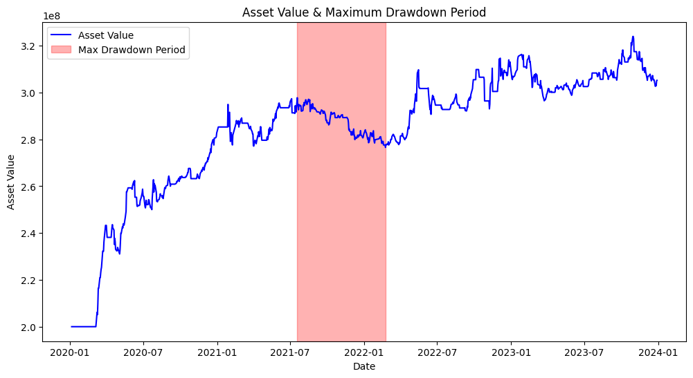
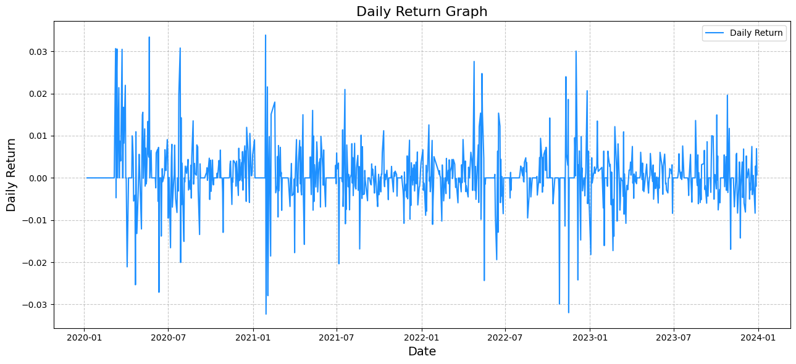

- Has link to the Optimization Report

## Out-of-sample Backtesting
### Parameter
```python
# Non-dynamic Parameters
MOMENTUM_FAST_EMA = 3
MOMENTUM_SLOW_EMA = 27
MOMENTUM_SIGNAL_EMA = 6
MOMENTUM_RSI_WINDOW = 6
MOMENTUM_RSI_THRESHOLD = 8
MOMENTUM_ATR_WINDOW = 12
MOMENTUM_ATR_MULTIPLIER = 9.044327484896122

REVERSION_FAST_EMA = 1
REVERSION_SLOW_EMA = 16
REVERSION_SIGNAL_EMA = 14
REVERSION_RSI_WINDOW = 28
REVERSION_ATR_WINDOW = 20
REVERSION_ATR_MULTIPLIER = 14.568689990866729

# Dynamic Parameters
MOMENTUM_FAST_EMA = 7
MOMENTUM_SLOW_EMA = 34
MOMENTUM_SIGNAL_EMA = 5
MOMENTUM_RSI_WINDOW = 14
MOMENTUM_RSI_THRESHOLD = 22
MOMENTUM_ATR_WINDOW = 14

REVERSION_FAST_EMA = 14
REVERSION_SLOW_EMA = 29
REVERSION_SIGNAL_EMA = 11
REVERSION_RSI_WINDOW = 11
REVERSION_ATR_WINDOW = 5
```

### Data
| Time       | Open   | High   | Low    | Close  | Volume |
|------------|--------|--------|--------|--------|--------|
| 2024-01-02 | 1138.5 | 1141.8 | 1131.0 | 1133.5 | 167307 |
| 2024-01-03 | 1130.5 | 1148.3 | 1126.5 | 1148.3 | 173569 |
| 2024-01-04 | 1146.0 | 1171.0 | 1145.5 | 1156.5 | 260804 |
| 2024-01-05 | 1156.1 | 1166.0 | 1154.2 | 1166.0 | 199452 |
| 2024-01-08 | 1166.1 | 1173.3 | 1160.6 | 1162.0 | 182329 |
| ...        | ...    | ...    | ...    | ...    | ...    |
| 2024-12-25 | 1333.6 | 1355.6 | 1332.0 | 1350.1 | 214617 |
| 2024-12-26 | 1350.9 | 1351.2 | 1347.2 | 1350.7 | 114315 |
| 2024-12-27 | 1352.9 | 1357.5 | 1348.5 | 1348.5 | 122457 |
| 2024-12-30 | 1346.8 | 1347.4 | 1342.0 | 1345.2 |  94688 |
| 2024-12-31 | 1344.9 | 1352.1 | 1344.5 | 1345.5 | 134784 |

### Step 6 of th Nine-Step

### Out-of-sample Backtesting Reuslt
- Non-dynamic algorithm result
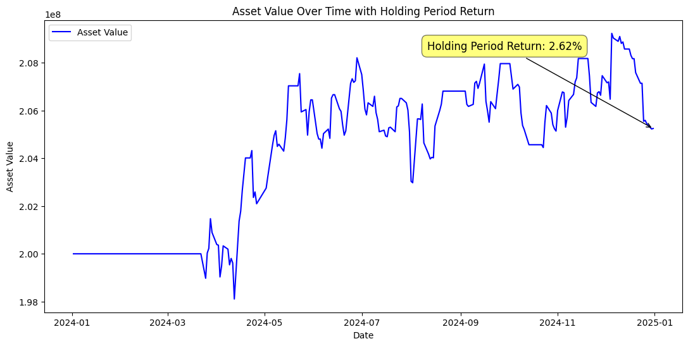
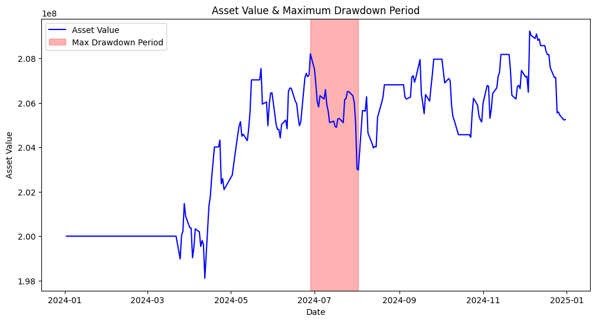
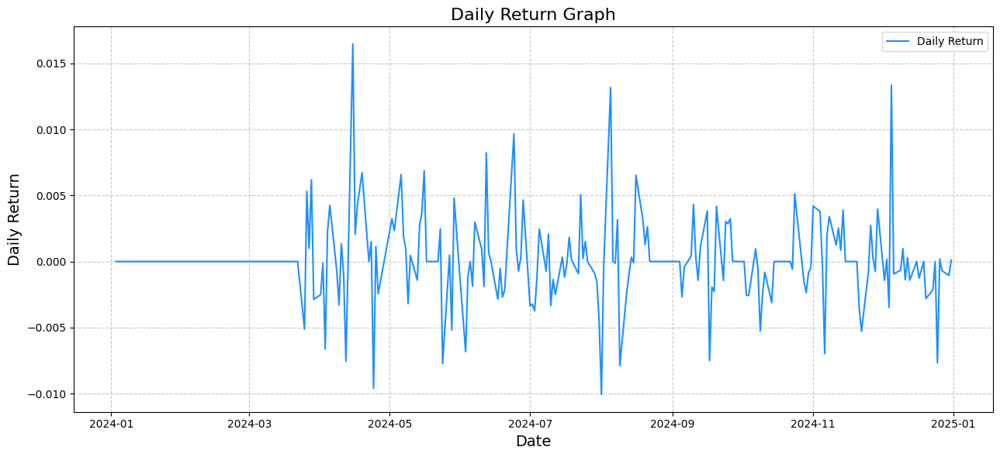

- Dynamic algorithm result
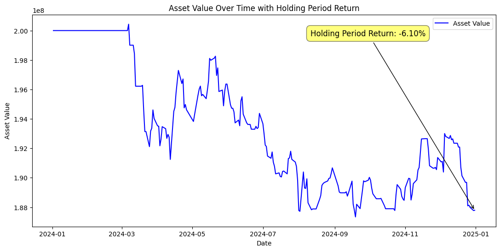

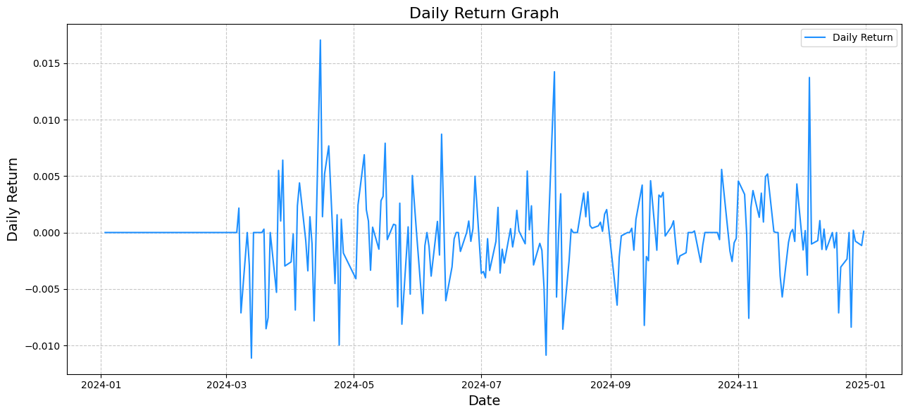


## Reference
- Appel, G. (2005). [Technical Analysis: Power Tools for Active Investors](https://dl.acm.org/doi/book/10.5555/1408581). FT Press.
- Wilder, J. W. (1978). [New Concepts in Technical Trading Systems](https://archive.org/details/newconceptsintec00wild).
- Truong, D. L., & Friday, H. S. (2021). [The Impact of the Introduction of Index Futures on the Daily Returns Anomaly in the Ho Chi Minh Stock Exchange](https://www.mdpi.com/2227-7072/9/3/43). *International Journal of Financial Studies*, 9(3), 43.
